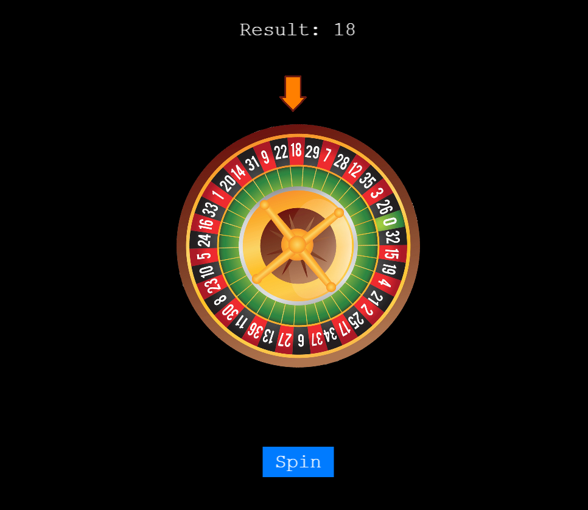

# Roulette Game



## Description

A simple 2D Roulette simulation built with [Phaser 3](https://phaser.io/). Click **Spin** to rotate the wheel and reveal a random number between 0 and 36. Includes spin sound effects and smooth tweening.

## Technologies & Tools

-   **Phaser 3**  
    A lightweight 2D game engine that provides:

    -   Asset loading (images & audio)
    -   Scene management and lifecycle (`preload`, `create`, `update`)
    -   Tweening & animation support
    -   Input handling (pointer/touch/keyboard)
    -   Canvas/WebGL rendering with automatic fallback
    -   Built-in sound playback via the Web Audio API

-   **Vite**  
    A fast development server and build tool for ES modules, offering:

    -   Instant hot-reload during development
    -   Optimized production bundles

-   **JavaScript (ES Modules)**  
    Modular code structure (`import`/`export`) that runs natively in the browser during development.

-   **HTML5 & CSS**

    -   `index.html` hosts the Phaser canvas
    -   Minimal CSS to center the game and style background

-   **Web Audio API (via Phaser.Sound)**  
    Phaser’s wrapper around the browser’s native audio capabilities for playing spin sound effects.

---

## Why Phaser 3?

1. **2D-Focused Engine**  
   Designed for rapid prototyping and production of 2D games.

2. **All-in-One API**  
   No need for separate libraries: asset loaders, animation systems, input handlers, and audio are built in.

3. **Simple Workflow**  
   A clear scene lifecycle and built-in tweens make it easy to implement smooth animations (e.g. wheel spins, card flips).

4. **Excellent Documentation & Community**  
   Vast amount of tutorials, examples, and plugins to speed up development and troubleshoot issues.

5. **High Performance**  
   Automatic Canvas/WebGL fallback ensures smooth frame rates on a wide range of devices.

> **Conclusion:**  
> Phaser 3 struck the perfect balance of simplicity, power, and performance for building a polished, animated, and audio-rich 2D roulette demo.

## Instruction

1. Install dependencies:

    ```bash
    npm install

    ```

2. Run app:

    ```bash
    npm run dev

    ```

3. Enter by link http://localhost:5173/
    ```bash
    http://localhost:5173/
    ```
